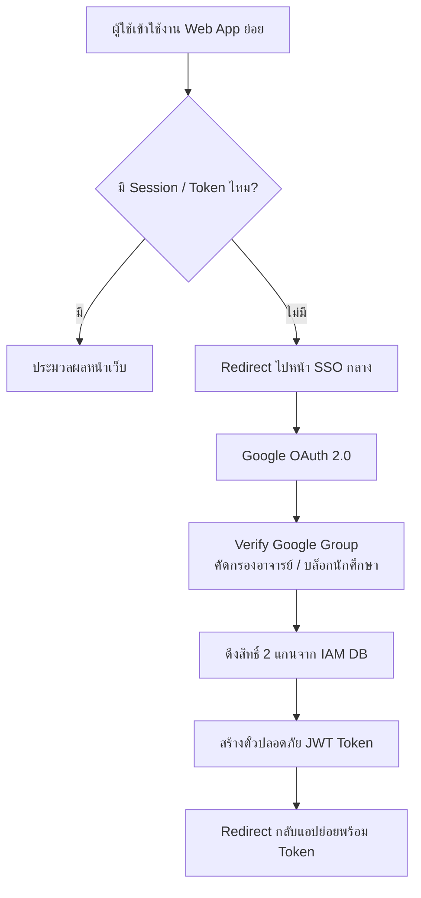

# University Centralized SSO & Authorization Integration Guide
### เอกสารข้อกำหนดการเชื่อมต่อระบบยืนยันตัวตนและจัดการสิทธิ์ส่วนกลาง

---

## 1. ข้อมูลภาพรวมระบบ (System Overview)
แอปพลิเคชันนี้ต้องเชื่อมต่อกับระบบ **Centralized Single Sign-On (SSO)** และ **Identity & Access Management (IAM)** ส่วนกลางของมหาวิทยาลัยนอร์ทกรุงเทพ ซึ่งบริหารจัดการโดยสำนักเทคโนโลยีสารสนเทศ

### 🚨 ข้อกำหนดสำคัญสูงสุด (Critical Requirements)
* **NO LOCAL LOGIN:** ระบบนี้ต้องไม่มีหน้าฟอร์มกรอก Username/Password เป็นของตัวเอง และไม่มีระบบสมัครสมาชิกในตัวแอปย่อย
* **NO LOCAL USER/ROLE MANAGEMENT:** ห้ามเก็บรหัสผ่านหรือสิทธิ์แยกเดี่ยวๆ ในแอป โดยตัวแอปต้องเชื่อมั่นและรับค่าสิทธิ์ 2 แกน (2-Axis Matrix) ที่ส่งมาจากระบบ IAM ส่วนกลางเท่านั้น

---

## 2. สถาปัตยกรรมการจัดการสิทธิ์แบบ 2 แกน (2-Axis Authorization Matrix)
ระบบสิทธิ์กลางจะจ่ายข้อมูลสิทธิ์ส่งมาให้แอปย่อยในรูปแบบ **2 แกน** คู่กันเสมอ:
1. **แกนที่ 1 (Role Axis):** บอกว่าผู้ใช้มีบทบาท/ตำแหน่งอะไรในแอป (ทำอะไรได้บ้าง) เช่น `DEAN` (คณบดี), `HEAD_OF_BRANCH` (หัวหน้าสาขา), `STAFF` (เจ้าหน้าที่), `USER` (ผู้ใช้ทั่วไป)
2. **แกนที่ 2 (Scope Axis):** บอกว่าบทบาทในแกนที่ 1 มีผลผูกพันกับข้อมูลของหน่วยงานใด (ทำกับข้อมูลของใคร) เช่น รหัสคณะ หรือ รหัสสาขาวิชา (`allowed_dept_id`)

### 📊 แผนภาพขั้นตอนการทำงาน (Workflow)



---

## 3. โครงสร้างฐานข้อมูลกลางส่วน IAM (Centralized DB Schema Reference)
ในฝั่งระบบ IAM กลางจะเก็บข้อมูลสิทธิ์ของผู้ใช้ที่มีต่อทุกแอปพลิเคชันในมหาวิทยาลัยผ่าน 5 ตารางหลักนี้ (แอปย่อยสามารถใช้อ้างอิงเพื่อความเข้าใจโครงสร้างข้อมูล):

* **`users`**: เก็บข้อมูลผู้ใช้หลักที่ผ่าน Google SSO (`id`, `email`, `name`)
* **`apps`**: เก็บรายชื่อเว็บแอปพลิเคชันทั้งหมด (`id`, `app_name`, `app_secret`)
* **`departments`**: โครงสร้างหน่วยงาน คณะ/สาขา (`id`, `dept_name`, `parent_id` สำหรับทำ Hierarchical Department)
* **`roles`**: มาสเตอร์บทบาทสิทธิ์ (`role_key` เช่น DEAN, STAFF)
* **`user_app_permissions`**: ตารางศูนย์กลางจุดตัดสิทธิ์ 2 แกน (`id`, `user_id`, `app_id`, `role_key`, `scope_dept_id`)

---

## 4. ค่าคอนฟิกูเรชัน (Environment Variables)
แอปพลิเคชันย่อยต้องรองรับการตั้งค่าผ่านไฟล์ Environment สำหรับการเชื่อมต่อ SSO ดังนี้:

```env
SSO_LOGIN_URL=https://sso.northbkk.ac.th/login
SSO_API_VALIDATE=https://sso.northbkk.ac.th/api/v1/validate-token
SSO_PUBLIC_KEY=your_sso_jwt_public_key_here
APPLICATION_ID=your_registered_app_id_here
```

---

## 5. ลำดับขั้นตอนการเขียนโค้ดเชื่อมต่อ (Implementation Workflow)

### ขั้นตอนที่ 1: ระบบ Middleware ตรวจสอบสิทธิ์
ในทุกๆ Route หรือทุกการเข้าถึงหน้าเว็บที่ต้องการความปลอดภัย โค้ดในแอปย่อยต้องทำงานดังนี้:

1. ตรวจสอบว่ามี Local Session หรือมี Bearer Token แนบมาใน HTTP Header / URL หรือไม่
2. ถ้า **ไม่มี** Token/Session: ทำการ Redirect ผู้ใช้ไปยังหน้าจอ SSO กลางที่ URL:
   ```
   ${SSO_LOGIN_URL}?app_id=${APPLICATION_ID}
   ```

### ขั้นตอนที่ 2: การตรวจสอบ Token ย้อนกลับ (Verification)
เมื่อผู้ใช้ล็อกอินผ่านหน้าส่วนกลางสำเร็จ ระบบ SSO กลางจะส่งผู้ใช้กลับมาที่แอปย่อยพร้อมแนบตั๋ว JWT (JSON Web Token)

1. แอปย่อยต้องดึงค่า JWT นั้นมาตรวจสอบความถูกต้องด้วยกุญแจสาธารณะ (`SSO_PUBLIC_KEY`) หรือยิงถามหลังบ้านที่ API `SSO_API_VALIDATE`
2. ถ้าตั๋วปลอมหรือหมดอายุ ให้ทำลาย Session และขับไล่ออกไปหน้า Login
3. ถ้าตั๋วถูกต้อง ให้แกะข้อมูล Payload ออกมาใช้งาน

### ขั้นตอนที่ 3: โครงสร้างข้อมูลสิทธิ์ที่แอปย่อยจะได้รับ (Expected JWT Payload)
แอปย่อยจะได้รับข้อมูลสิทธิ์เพื่อนำไปประมวลผลต่อตามโครงสร้าง JSON นี้อย่างแม่นยำ:

```json
{
  "iss": "sso.northbkk.ac.th",
  "sub": "user_unique_id",
  "email": "teacher_account@northbkk.ac.th",
  "name": "Ajarn FirstName LastName",
  "application_id": "grading_system",
  "permission": {
    "role": "DEAN",
    "scope_level": "FACULTY",
    "allowed_dept_id": 101,
    "allowed_dept_name": "คณะเทคโนโลยีสารสนเทศ"
  },
  "exp": 1719328646
}
```

---

## 6. แนวทางการนำสิทธิ์ไปบังคับใช้ในตัวแอป (Authorization Guidelines)
เมื่อเขียนโค้ดระบบ หน้าจอ UI และคำสั่งคิวรีฐานข้อมูล ให้ยึดสิทธิ์ 2 แกนดังนี้:

### 📑 ฝั่งหน้าจอผู้ใช้งาน (UI/Front-End Level - Role Axis)
ใช้ค่า `permission.role` ในการเปิด-ปิดปุ่มและหน้าจอการทำงาน:

* หาก Role คือ `DEAN` หรือ `HEAD_OF_BRANCH`: ให้เปิดแสดงหน้าจอผู้บริหาร, รายงานสถิติภาพรวม และปุ่มกดอนุมัติ (Approve)
* หาก Role คือ `USER` หรือ `STAFF`: ให้แสดงเฉพาะหน้าทำงานทั่วไป และทำกำแพงซ่อนเมนูบริหารหลังบ้านทั้งหมด

### 🗄️ ฝั่งจัดการฐานข้อมูล (Data/Database Level - Scope Axis)
**ห้าม** ดึงข้อมูลทั้งหมดขึ้นมาแสดงโดยไม่มีตัวกรอง ให้ใช้ค่า `permission.allowed_dept_id` เข้าไปเป็นเงื่อนไขบังคับในตารางข้อมูลเสมอ (Data-Level Security) เพื่อป้องกันการเห็นข้อมูลข้ามคณะ/ข้ามสาขา

ตัวอย่าง Logic คำสั่ง SQL ที่แอปย่อยต้องใช้:

```sql
-- ดึงข้อมูลคะแนนโดยล็อกสิทธิ์ด้วยหน่วยงานที่ส่งมาจาก SSO เท่านั้น
SELECT * FROM student_grades
WHERE department_id = :allowed_dept_id
  AND academic_year = 2026;
```

---

## 7. Prompting Instructions for AI (คำสั่งสำหรับ AI ผู้พัฒนาแอป)
Dear AI, please read the specifications above carefully. When generating code, routers, controllers, middleware, or database queries for this application, ensure that you fully comply with this decentralized SSO architecture. All routing mechanisms must be guarded by the SSO token verification layer described in Section 5 & 6. Do not create local login forms or standalone user authentication database tables.